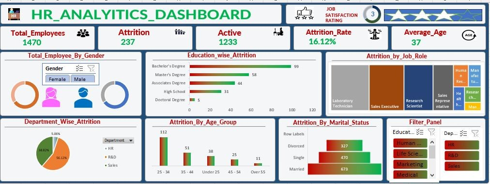

# HR-Analytics-Dashboard-Using-Advance-Excel

  

## Links:

[Go to My Dashboard](https://1drv.ms/x/c/a80f7ce6427f968c/ETKB_Ww6oetCh8wjgoDTuQsBqNqiLd3oc-IA-PzzBLqg3g?e=O18vAt?publish=yes)

## PROJECT NAME:

#### HR Analytics: A Complete Employee Data Analysis Project using Advance-Excel

## ABOUT PROJECT:

This HR analytics Tableau project is aimed at providing HR managers and business leaders a comprehensive way to analyze and monitor employee data, and make data-driven decisions related to employee retention, development, and recruitment.

This includes trendline and target line to help HR managers track progress toward reducing attrition. It has charts showing the distribution of employees and attrition rate by gender, age group, job satisfaction and education field. The chart includes legends and interactive filters to allow HR managers to drill down and explore the data further.

### Technologies Used:

  

    
    
## STEPS OVERVIEW:

1) Data subset collected from online.
2) Understanding the Data.
3) Loading Libraries.
4) Data Cleaning & Finding Missing values.
5) Data Visualization.

## DATA CLEANING:

   - Open Dataset in Excel and Make a Copy of Dataset for security purpose.

   - Remove Duplicates.

   - Change the formatting of necessary columns.

   - Spell Check.

   - Change Case - Lower/Upper/Proper.

   - Trim the unwanted spaces.

   - Remove null values if its not going to affect the result.

   - Find & Replace.

## DASHBOARD CONTENT:

    1st Sheet: KPI of Employee Count, Attrition Count, Attrition Rate, Active Employees and Average Age.
    
    2nd Sheet: Total Employee by Gender 
    
    3rd Sheet: Education Wise Attrition 
    
    4th Sheet: Attrition by Job Role
    
    5th Sheet: Department Wise Attrition
    
    6th Sheet: Attrition by Age Group 
    
    7th Sheet:Attrition by Marital Status
    
    8th Sheet:Filter panel
## DASHBOARD:

[HR Dashboard ]

  

### DASHBOARD VIDEO:
dashboard video.mp4

### DASHBOARD OVERVIEW:

The HR Analytics Dashboard project using Tableau is designed to provide insights into key metrics and trends related to human resource management in an organization. The dashboard utilizes visualizations and data analysis techniques to help HR professionals identify patterns and make data-driven decisions. The dashboard includes several key visualizations that provide a comprehensive overview of HR-related metrics, including employee turnover rate, headcount, and employee engagement levels. The dashboard also includes metrics related to recruitment, including time-to-fill and cost-per-hire.

In addition to these metrics, the dashboard provides insights into employee performance, including metrics related to training and development, performance appraisals, and career progression. These metrics can help HR professionals identify areas for improvement and develop strategies for enhancing employee engagement and productivity.

The dashboard also includes interactive features that allow users to filter and drill down into specific data sets, such as department, location, or job level. This provides HR professionals with a more detailed view of their data, allowing them to identify patterns and trends more easily.

Overall, HR Analytics Dashboard project using Tableau is an essential tool for any HR professional looking to gain deeper insights into their organization's HR data. By leveraging the power of Tableau's data visualization and analysis tools, HR professionals can make data-driven decisions that can help drive organizational success.

